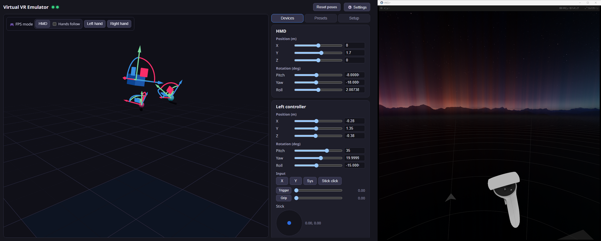
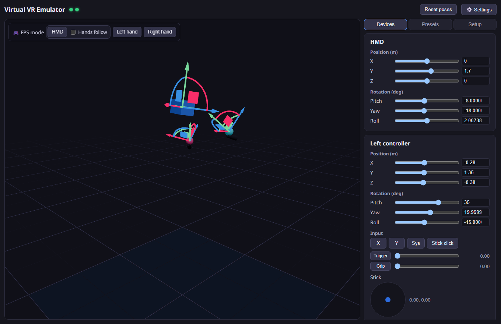
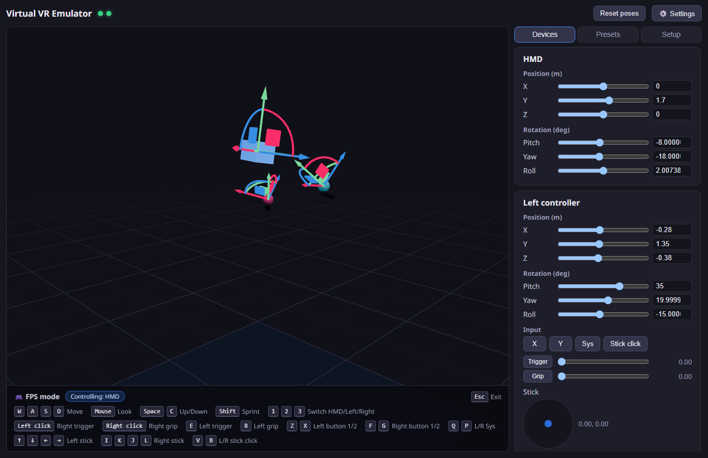
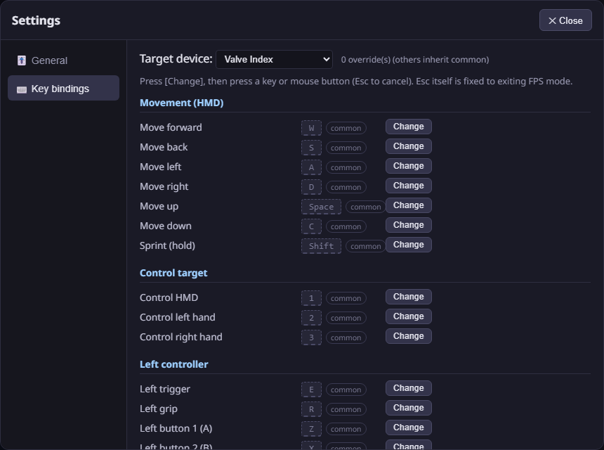

# Virtual VR Emulator (VVRE)

[日本語](README.md) | **English** | [简体中文](README.zh.md) | [한국어](README.ko.md)

A development/debugging tool that runs SteamVR without a physical VR headset, letting you control a virtual HMD and controllers from a GUI.


- **Virtual devices**: HMD + left/right controllers (emulated as Quest 3 / Quest 2 / Pico 4 / Valve Index / HTC Vive)
- **Control**: three.js 3D viewport gizmos / sliders / keyboard & mouse FPS mode
- **Input**: buttons (A/B/X/Y/System), triggers, grips, joysticks, haptics feedback
- **More**: pose presets, setup helper (driver registration, SteamVR settings, restart)
- **Languages**: 日本語, English, 简体中文, 한국어 (auto-detected from OS, switchable in Settings → General)

Poses driven from the app are reflected directly in SteamVR (right: VR View):



## Structure

```
├─ app/      Tauri v2 + React + TypeScript GUI app (with built-in WebSocket hub)
├─ driver/   C++ SteamVR (OpenVR) driver "vvre"
└─ docs/     Protocol specification
```

```
React UI ──WS──► Rust hub (127.0.0.1:18320) ──WS──► driver_vvre.dll (inside vrserver.exe)
                  │ caches latest state, replays on reconnect   │ submits poses at 250 Hz
                  └ future: external automation API             └ updates input components
```

## Installation

Download the installer (`.msi` or `-setup.exe`) from [GitHub Releases](https://github.com/sasaken1102r/Virtual-VR-Emulator/releases) and run it. Steam + SteamVR are required.

> **Note**: The installer is unsigned, so Windows SmartScreen may show a warning ("More info" → "Run anyway").

After installing, register the driver and apply SteamVR settings from the app's "Setup" tab and you're ready. To build from source, see below.

## Requirements (building from source)

- Windows 11 + Steam + SteamVR
- Visual Studio 2022 (C++ workload) + CMake 3.20+
- Node.js 20+ / Rust (Tauri v2 requirements)

## Build

```powershell
# 1. Driver
cmake -S driver -B driver/build -G "Visual Studio 17 2022" -A x64
cmake --build driver/build --config Release
# → the driver package is generated in driver/output/vvre/

# 2. App (development)
cd app
npm install
npm run tauri dev

# 2'. App (distribution build; bundles driver/output/vvre as a resource)
npm run tauri build
```

## First-time setup

From the app's "Setup" panel:

1. **Install driver** — copies to `%LOCALAPPDATA%\vvre\driver\vvre` and registers via `vrpathreg adddriver`
2. **Apply SteamVR settings** — writes `requireHmd: false` / `activateMultipleDrivers: true` to `<Steam>\config\steamvr.vrsettings` (with automatic backup)
3. **Restart SteamVR**

For development you can also register the repo's `driver/output/vvre` directly:

```powershell
& "C:\Program Files (x86)\Steam\steamapps\common\SteamVR\bin\win64\vrpathreg.exe" adddriver <repo>\driver\output\vvre
```

## Usage



- View SteamVR output via SteamVR → "Display VR View"
- The fullscreen "Headset Window" (the virtual HMD's debug display) is minimized automatically while the app is running (you can restore it from the taskbar, but it re-minimizes every 3 seconds)
- **FPS mode**: three variants — HMD, left hand, right hand (start from the toolbar at the top-left of the 3D view; switch with 1/2/3 during the mode)
  - HMD mode: with "Hands follow" enabled, controllers follow the HMD like anchored children (position + rotation). Left click = right trigger / right click = right grip
  - Left/right hand mode: move only that hand with WASD + mouse. Left click = that hand's trigger / right click = that hand's grip
  - Default bindings: left click = right trigger / right click = right grip / E, R = left trigger, grip / F, G = right buttons 1, 2 / Z, X = left buttons 1, 2 / Q, P = left/right Sys / V, B = left/right stick click / arrows = left stick / I, K, J, L = right stick / Space, C = up/down / Shift = sprint / Esc = exit (fixed)
  - Buttons are abstract "button 1/2" actions, automatically mapped to the real buttons per device (touch = X/Y & A/B, Index = A/B, Vive = menu)
  - The currently controlled device glows in the 3D view

  
- **Settings** (⚙️ in the header):
  - Key bindings: switch between "Common (all devices)" and per-device-profile overrides via a select box. Non-overridden entries inherit common (gray + "common" badge). Both keys and mouse buttons can be bound, with duplicate warnings
  - Sensitivity: sliders for mouse sensitivity and walk/sprint speed
  - Saved to `%APPDATA%\vvre\settings.json`

  
- **Profile switching** (Quest 3 / Quest 2 / Pico 4 / Index / Vive) requires a SteamVR restart (properties are fixed at Activate time). The input layout also changes per profile (Index = thumbstick + grip force, Vive = trackpad + menu)
- The virtual HMD reports "worn" via a proximity sensor at all times, so it never drops into standby when idle
- vvre devices appear in SteamVR **only while the app is running**. If SteamVR starts without the app, vvre registers no devices (they appear automatically once the app starts); when the app exits or crashes, the devices become "disconnected"

## Debugging

- Driver log: grep `<Steam>\logs\vrserver.txt` for `[vvre]`
- SteamVR web console: `http://localhost:27062/console/index.html`
- Device checks: `vrcmd.exe --info` / `--pollposes` / `--pollcontrollers`
- Reloading the driver requires a SteamVR restart (stop it before rebuilding — the DLL gets locked)

## Known caveats

- **Coexistence with a real headset is untested**: while this app is running, vvre presents an HMD, and it is unverified which driver wins the HMD slot if a real headset connects at the same time (e.g. via Virtual Desktop). When using real hardware, simply **quit this app** — vvre then presents no devices
- The Pico 4 profile is verified up to SteamVR recognition (shown as PICO 4) and input profile loading. Since SteamVR ships no official Pico resources, the render model is generic and bindings are custom-defined — binding compatibility in actual apps is best-effort
- Skeletal (finger) input is not implemented. VRChat should fall back to button-based gestures (this is VRChat's own behavior and has not been verified in actual play)

## Future extensions (designed, not implemented)

- Virtual Vive trackers (FBT testing) — just add entries to the `devices` array in the `config` message
- Motion recording & playback — the hub already relays every message, so only a recording layer is needed
- External automation API — external clients can connect to the hub (ws://127.0.0.1:18320) as-is (see [docs/PROTOCOL.md](docs/PROTOCOL.md))

## License

[MIT License](LICENSE). For bundled third-party software licenses, see [THIRD_PARTY_NOTICES.md](THIRD_PARTY_NOTICES.md).
