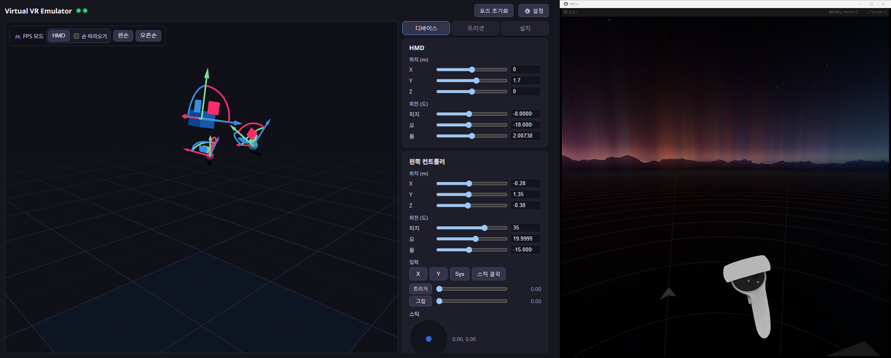
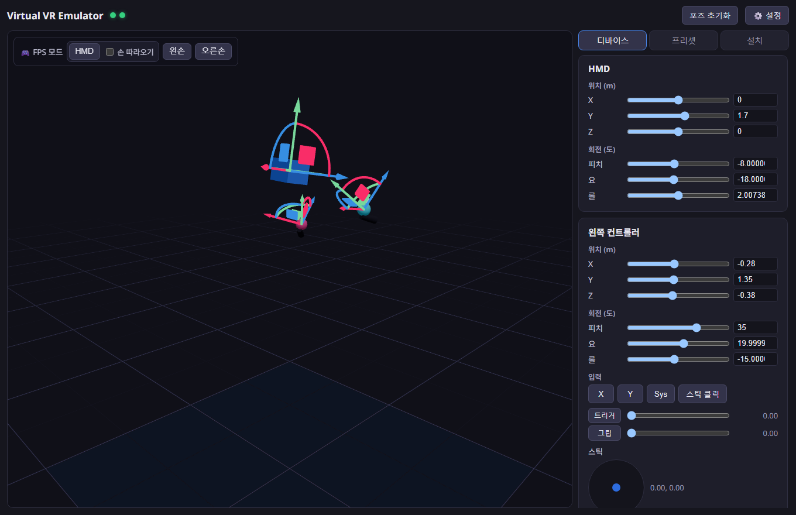
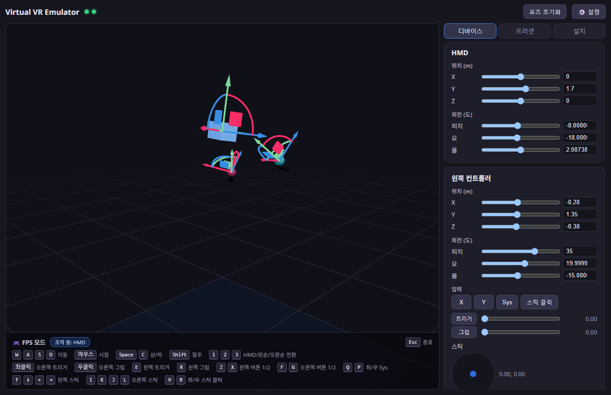
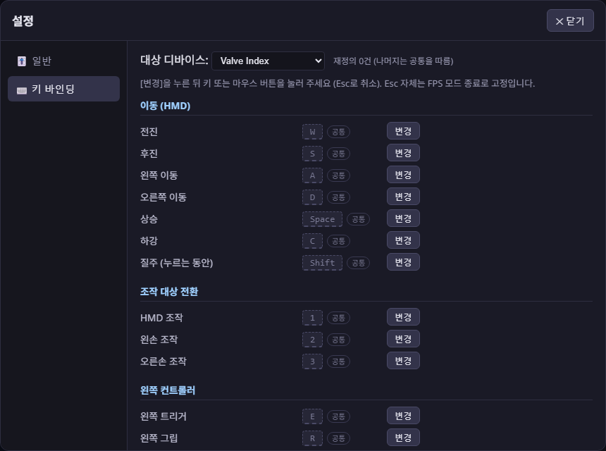

# Virtual VR Emulator (VVRE)

[日本語](README.md) | [English](README.en.md) | [简体中文](README.zh.md) | **한국어**

실제 VR 헤드셋을 연결하지 않고 SteamVR을 실행하여, 가상 HMD와 컨트롤러를 GUI로 조작할 수 있는 개발/디버깅 도구입니다.


- **가상 디바이스**: HMD + 좌우 컨트롤러 (Quest 3 / Quest 2 / Pico 4 / Valve Index / HTC Vive로 에뮬레이션)
- **조작**: three.js 3D 뷰포트의 기즈모 / 슬라이더 / 키보드·마우스 FPS 모드
- **입력**: 버튼(A/B/X/Y/System), 트리거, 그립, 조이스틱, 햅틱 수신
- **기타**: 포즈 프리셋 저장, 설치 도우미(드라이버 등록·SteamVR 설정·재시작)
- **다국어**: 日本語, English, 简体中文, 한국어 (첫 실행 시 OS 언어 자동 감지, 설정→일반에서 전환)

앱에서 움직인 포즈는 그대로 SteamVR(오른쪽: VR 보기)에 반영됩니다:



## 구성

```
├─ app/      Tauri v2 + React + TypeScript GUI 앱 (WebSocket 허브 내장)
├─ driver/   C++ SteamVR (OpenVR) 드라이버 "vvre"
└─ docs/     프로토콜 사양
```

```
React UI ──WS──► Rust 허브 (127.0.0.1:18320) ──WS──► driver_vvre.dll (vrserver.exe 내)
                  │ 최신 상태 캐시 + 재연결 시 재생        │ 250Hz로 포즈 전송
                  └ 향후: 외부 자동화 API                  └ 입력 컴포넌트 갱신
```

## 요구 사항

- Windows 11 + Steam + SteamVR
- Visual Studio 2022 (C++ 워크로드) + CMake 3.20+
- Node.js 20+ / Rust (Tauri v2 요구 사항)

## 빌드

```powershell
# 1. 드라이버
cmake -S driver -B driver/build -G "Visual Studio 17 2022" -A x64
cmake --build driver/build --config Release
# → driver/output/vvre/ 에 드라이버 패키지가 생성됨

# 2. 앱 (개발)
cd app
npm install
npm run tauri dev

# 2'. 앱 (배포 빌드; driver/output/vvre 를 리소스로 동봉)
npm run tauri build
```

## 최초 설치

앱의 「설치」 패널에서:

1. **드라이버 설치** — `%LOCALAPPDATA%\vvre\driver\vvre` 로 복사 후 `vrpathreg adddriver` 로 등록
2. **SteamVR 설정 적용** — `<Steam>\config\steamvr.vrsettings` 에 `requireHmd: false` / `activateMultipleDrivers: true` 기록(자동 백업)
3. **SteamVR 재시작**

개발 시에는 저장소의 `driver/output/vvre` 를 직접 등록해도 됩니다:

```powershell
& "C:\Program Files (x86)\Steam\steamapps\common\SteamVR\bin\win64\vrpathreg.exe" adddriver <repo>\driver\output\vvre
```

## 사용법



- SteamVR 화면은 SteamVR → 「VR 보기 표시」로 확인
- 전체 화면으로 나타나는 「Headset Window」(가상 HMD의 디버그 표시)는 앱 실행 중 자동으로 최소화됨(작업 표시줄에서 복원 가능하지만 3초마다 다시 최소화됨)
- **FPS 모드**: HMD·왼손·오른손 3종류(3D 뷰 좌측 상단 툴바에서 시작, 모드 중 1/2/3으로 전환)
  - HMD 모드: 「손 따라오기」 ON 시 컨트롤러가 HMD에 앵커된 것처럼 따라옴(위치+회전). 좌클릭=오른쪽 트리거 / 우클릭=오른쪽 그립
  - 왼손/오른손 모드: 그 손만 WASD+마우스로 조작. 좌클릭=그 손의 트리거 / 우클릭=그 손의 그립
  - 기본 바인딩: 좌클릭=오른쪽 트리거 / 우클릭=오른쪽 그립 / E·R=왼쪽 트리거·그립 / F·G=오른쪽 버튼1·2 / Z·X=왼쪽 버튼1·2 / Q·P=좌우 Sys / V·B=좌우 스틱 클릭 / 방향키=왼쪽 스틱 / I·K·J·L=오른쪽 스틱 / Space·C=상하 / Shift=질주 / Esc=종료(고정)
  - 버튼은 추상적인 「버튼1/2」 액션으로, 디바이스별 실제 버튼(touch=X/Y·A/B, Index=A/B, Vive=메뉴)에 자동 매핑됨
  - 조작 중인 디바이스는 3D 뷰에서 발광 하이라이트됨

  
- **설정** (헤더의 ⚙️):
  - 키 바인딩: 「공통(모든 디바이스)」과 디바이스 프로필별 재정의를 셀렉트 박스로 전환. 재정의하지 않은 항목은 공통을 따름(회색+「공통」 배지). 키와 마우스 버튼 모두 할당 가능, 중복 경고 포함
  - 감도: 마우스 감도·걷기/질주 속도 슬라이더
  - `%APPDATA%\vvre\settings.json` 에 저장

  
- **프로필 전환** (Quest 3 / Quest 2 / Pico 4 / Index / Vive)은 SteamVR 재시작 필요(속성이 Activate 시 고정되기 때문). 프로필에 따라 입력 구성도 변경됨(Index=썸스틱+그립 압력, Vive=트랙패드+메뉴)
- 가상 HMD는 근접 센서로 항상 「착용 중」을 보고하므로 방치해도 대기 모드로 전환되지 않음
- vvre 디바이스는 **앱이 실행 중일 때만** SteamVR에 나타남. 앱 없이 SteamVR을 시작하면 vvre는 디바이스를 등록하지 않고(나중에 앱을 시작하면 자동으로 나타남), 앱 종료/크래시 시 디바이스는 「연결 끊김」이 됨

## 디버깅

- 드라이버 로그: `<Steam>\logs\vrserver.txt` 에서 `[vvre]` 검색
- SteamVR 웹 콘솔: `http://localhost:27062/console/index.html`
- 디바이스 확인: `vrcmd.exe --info` / `--pollposes` / `--pollcontrollers`
- 드라이버 리로드에는 SteamVR 재시작 필요(DLL이 잠기므로 빌드 전에 중지)

## 알려진 주의 사항

- **실제 헤드셋과의 병행 사용은 미검증**: 이 앱이 실행 중일 때 vvre가 HMD를 자처하므로, 동시에 실기기(예: Virtual Desktop)를 연결하면 어느 드라이버가 HMD 슬롯을 차지하는지 검증되지 않음. 실기기를 사용할 때는 **이 앱을 종료**하면 vvre는 아무 디바이스도 자처하지 않으므로 안전함
- Pico 4 프로필은 SteamVR에서의 인식(PICO 4 표시)과 입력 프로필 로딩까지 검증됨. SteamVR에 Pico 공식 리소스가 없어 렌더 모델은 제네릭·바인딩은 자체 정의이며, 실제 앱에서의 바인딩 호환성은 최선 노력 수준
- 스켈레탈(손가락) 입력은 미구현. VRChat은 버튼 기반 제스처로 폴백할 것으로 예상됨(VRChat 자체 사양이며 실제 플레이에서는 미검증)

## 향후 확장(설계 완료·미구현)

- 가상 Vive 트래커(FBT 테스트) — `config` 메시지의 `devices` 배열에 추가하기만 하면 됨
- 모션 녹화·재생 — 허브가 모든 메시지를 중계하므로 녹화 레이어만 추가하면 됨
- 외부 자동화 API — 외부 클라이언트가 허브(ws://127.0.0.1:18320)에 그대로 연결 가능 ([docs/PROTOCOL.md](docs/PROTOCOL.md) 참조)

## 라이선스

[MIT License](LICENSE). 동봉된 서드파티 소프트웨어 라이선스는 [THIRD_PARTY_NOTICES.md](THIRD_PARTY_NOTICES.md) 를 참조하세요.
