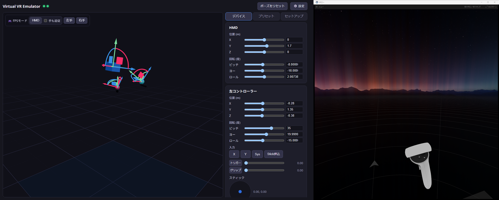
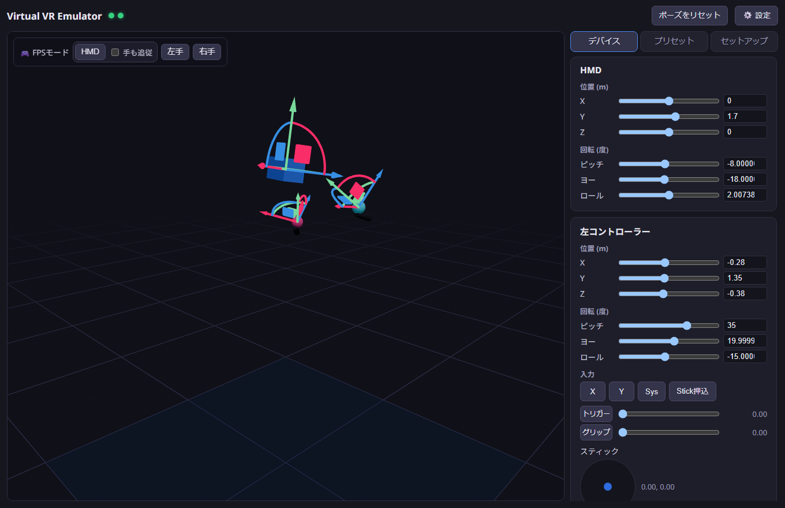
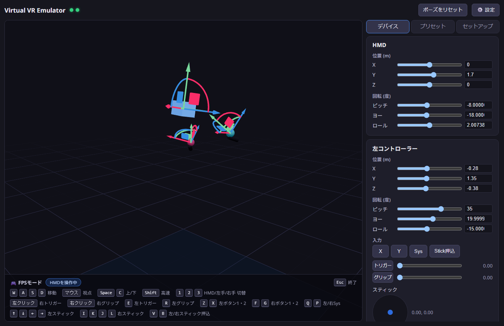
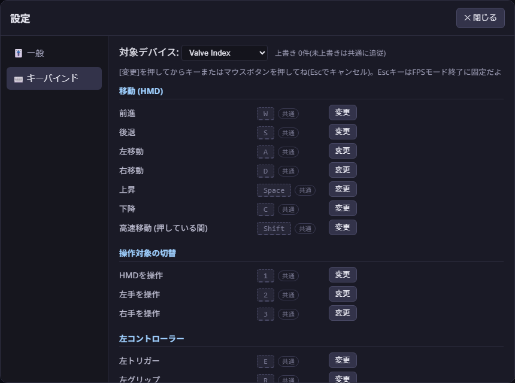

# Virtual VR Emulator (VVRE)

**日本語** | [English](README.en.md) | [简体中文](README.zh.md) | [한국어](README.ko.md)

実機のVRヘッドセットを接続せずにSteamVRを動かして、仮想HMD・コントローラーをGUIから操作できる開発/デバッグ用ツール。


- **仮想デバイス**: HMD + 左右コントローラー(Quest 3 / Quest 2 / Pico 4 / Valve Index / HTC Viveとしてエミュレート)
- **操作**: three.js 3Dビューのギズモ / スライダー / キーボード・マウスのFPSモード
- **入力**: ボタン(A/B/X/Y/System)・トリガー・グリップ・ジョイスティック、ハプティクス受信
- **その他**: ポーズプリセット保存、セットアップヘルパー(ドライバー登録・SteamVR設定・再起動)
- **多言語対応**: 日本語・English・简体中文・한국어(初回はOS言語を自動検出、設定の「一般」で切替)

アプリで動かしたポーズは、そのままSteamVR(右: VRビュー)に反映される:



## 構成

```
├─ app/      Tauri v2 + React + TypeScript のGUIアプリ (WebSocketハブ内蔵)
├─ driver/   C++製 SteamVR (OpenVR) ドライバー "vvre"
└─ docs/     プロトコル仕様
```

```
React UI ──WS──► Rustハブ(127.0.0.1:18320) ──WS──► driver_vvre.dll (vrserver.exe内)
                  │ 最新状態キャッシュ+再接続時リプレイ        │ 250Hzでポーズ送信
                  └ 将来: 外部自動化API                        └ 入力コンポーネント更新
```

## 必要環境

- Windows 11 + Steam + SteamVR
- Visual Studio 2022 (C++ワークロード) + CMake 3.20+
- Node.js 20+ / Rust (Tauri v2要件)

## ビルド

```powershell
# 1. ドライバー
cmake -S driver -B driver/build -G "Visual Studio 17 2022" -A x64
cmake --build driver/build --config Release
# → driver/output/vvre/ にパッケージ一式が生成される

# 2. アプリ (開発)
cd app
npm install
npm run tauri dev

# 2'. アプリ (配布ビルド。driver/output/vvre をリソース同梱)
npm run tauri build
```

## セットアップ(初回)

アプリの「セットアップ」パネルから:

1. **ドライバーをインストール** — `%LOCALAPPDATA%\vvre\driver\vvre` へコピーして `vrpathreg adddriver` で登録
2. **SteamVR設定を適用** — `<Steam>\config\steamvr.vrsettings` に `requireHmd: false` / `activateMultipleDrivers: true` を書き込み(バックアップ自動作成)
3. **SteamVRを再起動**

開発時はリポジトリの `driver/output/vvre` を直接登録してもOK:

```powershell
& "C:\Program Files (x86)\Steam\steamapps\common\SteamVR\bin\win64\vrpathreg.exe" adddriver <repo>\driver\output\vvre
```

## 使い方



- SteamVRの映像は SteamVR → 「VRビューを表示」で確認
- デスクトップ全面に出る「Headset Window」(仮想HMDのデバッグ表示)は、アプリが起動していれば自動で最小化される(タスクバーから戻せば再表示も可能だが3秒ごとに再最小化される)
- **FPSモード**: HMD主体・左手主体・右手主体の3種類(3Dビュー左上のツールバーから開始、モード中も1・2・3で切替)
  - HMD主体: 「手も追従」ONでコントローラーがHMDを親としたアンカーのように追従(位置+回転)。左クリック=右手トリガー / 右クリック=右手グリップ
  - 左手/右手主体: その手だけをWASD+マウスで操作。左クリック=その手のトリガー / 右クリック=その手のグリップ
  - デフォルトバインド: 左クリック=右トリガー / 右クリック=右グリップ / E・R=左トリガー・グリップ / F・G=右ボタン1・2 / Z・X=左ボタン1・2 / Q・P=左右Sys / V・B=左右スティック押込 / 矢印=左スティック / I・K・J・L=右スティック / Space・C=上下 / Shift=高速 / Esc=解除(固定)
  - ボタンは「ボタン1/2」の抽象アクションで、デバイスごとの実ボタン(touch=X/Y・A/B、Index=A/B、Vive=メニュー)に自動変換される
  - 操作中のデバイスは3Dビューで発光ハイライトされる

  

- **設定画面** (ヘッダーの⚙️):
  - キーバインド: 「共通(全デバイス)」+デバイスプロファイル別の上書きをセレクトボックスで切替。未上書きの項目は共通に追従(グレー表示+「共通」バッジ)。キーもマウスボタンも割当可能、重複警告付き
  - 操作感度: マウス感度・歩行/高速移動速度のスライダー
  - `%APPDATA%\vvre\settings.json` に保存

  
- **プロファイル切替** (Quest 3 / Quest 2 / Pico 4 / Index / Vive) はSteamVR再起動が必要(プロパティがActivate時に固定されるため)。プロファイルごとに入力構成も変わる(Index=サムスティック+グリップ感圧、Vive=トラックパッド+メニュー)
- 仮想HMDは近接センサーで常時「装着中」を報告するので、放置してもスタンバイに落ちない
- vvreのデバイスは**アプリが起動している間だけ**SteamVRに現れる。アプリなしでSteamVRを起動するとvvreはデバイスを登録せず(後からアプリを起動すれば自動で現れる)、アプリ終了/クラッシュ時はデバイスが「未接続」になる

## デバッグ

- ドライバーログ: `<Steam>\logs\vrserver.txt` を `[vvre]` でgrep
- SteamVR Webコンソール: `http://localhost:27062/console/index.html`
- デバイス確認: `vrcmd.exe --info` / `--pollposes` / `--pollcontrollers`
- ドライバーの再読込はSteamVR再起動が必要(DLLがロックされるのでビルド前に停止)

## 既知の注意点

- **実機ヘッドセットとの併用は未検証**: このアプリの起動中はvvreがHMDを名乗るため、実機(Virtual Desktop等)と同時に使った場合どちらがHMDスロットを取るかは検証していない。実機を使う時は**このアプリを終了しておけばvvreはデバイスを名乗らない**ので安全
- Pico 4プロファイルは、SteamVR上での認識(PICO 4表示)と入力プロファイルの読込までは検証済み。ただしSteamVRにPico公式リソースがないためレンダーモデルはgeneric・バインディングは自前定義で、実アプリでのバインディング互換はベストエフォート
- スケルタル(指)入力は未実装。VRChatはボタンベースのジェスチャーにフォールバックするはず(VRChat側の仕様によるもので、実プレイでは未検証)

## 将来の拡張(設計済み・未実装)

- 仮想Viveトラッカー(FBTテスト) — `config`メッセージの`devices`配列に追加するだけ
- モーション記録&再生 — ハブが全メッセージを中継しているので記録層を足すだけ
- 外部自動化API — ハブ(ws://127.0.0.1:18320)に外部クライアントがそのまま接続可能([docs/PROTOCOL.md](docs/PROTOCOL.md)参照)

## ライセンス

[MIT License](LICENSE)。同梱しているサードパーティ製ソフトウェアのライセンスは [THIRD_PARTY_NOTICES.md](THIRD_PARTY_NOTICES.md) を参照。
