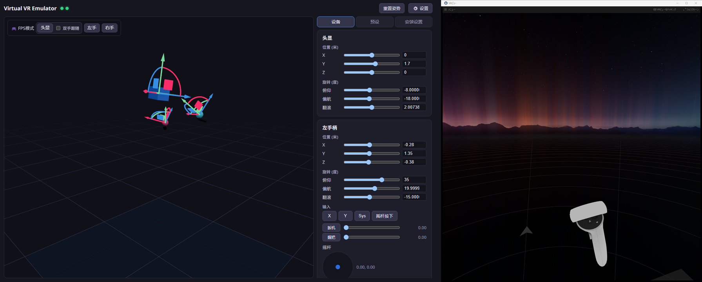
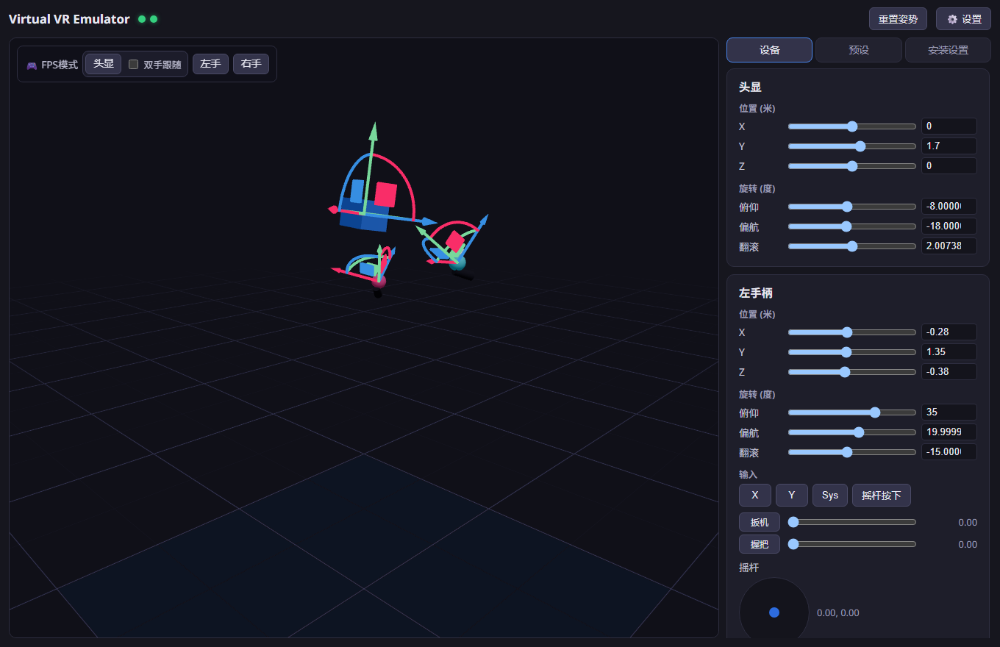
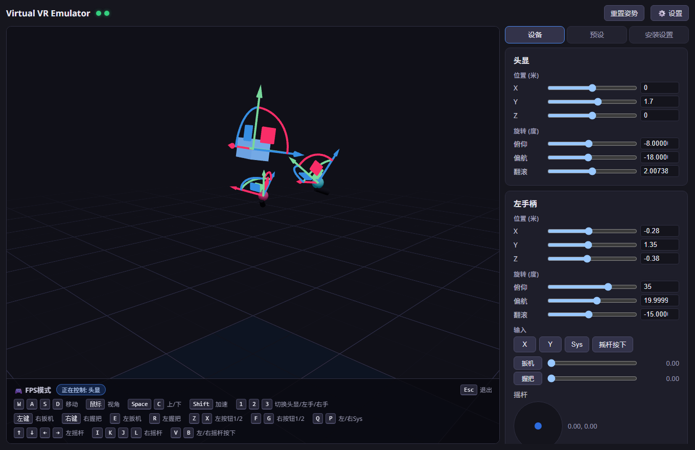
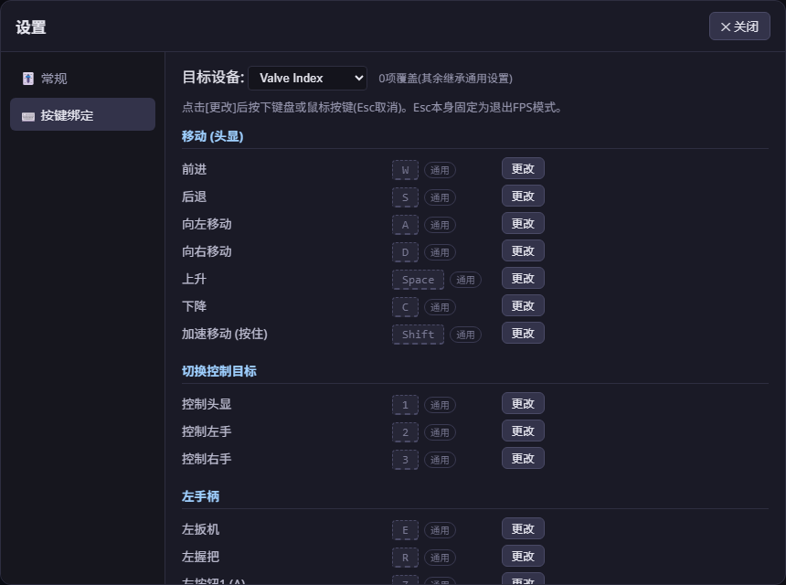

# Virtual VR Emulator (VVRE)

[日本語](README.md) | [English](README.en.md) | **简体中文** | [한국어](README.ko.md)

无需连接真实VR头显即可运行SteamVR的开发/调试工具,可通过GUI控制虚拟头显和手柄。


- **虚拟设备**: 头显 + 左右手柄(可模拟为 Quest 3 / Quest 2 / Pico 4 / Valve Index / HTC Vive)
- **操作**: three.js 3D视口的变换手柄 / 滑块 / 键盘鼠标FPS模式
- **输入**: 按钮(A/B/X/Y/System)、扳机、握把、摇杆,以及震动反馈接收
- **其他**: 姿势预设保存、安装助手(驱动注册、SteamVR设置、重启)
- **多语言**: 日本語、English、简体中文、한국어(首次启动自动检测系统语言,可在设置→常规中切换)

在应用中移动的姿态会直接反映到SteamVR(右: VR视图):



## 结构

```
├─ app/      Tauri v2 + React + TypeScript 的GUI应用 (内置WebSocket中枢)
├─ driver/   C++编写的 SteamVR (OpenVR) 驱动 "vvre"
└─ docs/     协议规范
```

```
React UI ──WS──► Rust中枢 (127.0.0.1:18320) ──WS──► driver_vvre.dll (vrserver.exe内)
                  │ 缓存最新状态,重连时重放              │ 以250Hz提交姿态
                  └ 未来: 外部自动化API                  └ 更新输入组件
```

## 环境要求

- Windows 11 + Steam + SteamVR
- Visual Studio 2022 (C++工作负载) + CMake 3.20+
- Node.js 20+ / Rust (Tauri v2要求)

## 构建

```powershell
# 1. 驱动
cmake -S driver -B driver/build -G "Visual Studio 17 2022" -A x64
cmake --build driver/build --config Release
# → 驱动包生成在 driver/output/vvre/

# 2. 应用 (开发)
cd app
npm install
npm run tauri dev

# 2'. 应用 (发布构建;将 driver/output/vvre 作为资源打包)
npm run tauri build
```

## 首次安装

在应用的「安装设置」面板中:

1. **安装驱动** — 复制到 `%LOCALAPPDATA%\vvre\driver\vvre` 并通过 `vrpathreg adddriver` 注册
2. **应用SteamVR设置** — 向 `<Steam>\config\steamvr.vrsettings` 写入 `requireHmd: false` / `activateMultipleDrivers: true`(自动备份)
3. **重启SteamVR**

开发时也可以直接注册仓库中的 `driver/output/vvre`:

```powershell
& "C:\Program Files (x86)\Steam\steamapps\common\SteamVR\bin\win64\vrpathreg.exe" adddriver <repo>\driver\output\vvre
```

## 使用方法



- 通过 SteamVR → 「显示VR视图」查看SteamVR画面
- 全屏的「Headset Window」(虚拟头显的调试显示)在应用运行时会自动最小化(可从任务栏恢复,但每3秒会再次最小化)
- **FPS模式**: 头显、左手、右手三种(从3D视图左上角的工具栏启动,模式中可用1/2/3切换)
  - 头显模式: 开启「双手跟随」后,手柄像锚定在头显上一样跟随(位置+旋转)。左键=右扳机 / 右键=右握把
  - 左手/右手模式: 仅用WASD+鼠标移动该手。左键=该手的扳机 / 右键=该手的握把
  - 默认绑定: 左键=右扳机 / 右键=右握把 / E、R=左扳机、左握把 / F、G=右按钮1、2 / Z、X=左按钮1、2 / Q、P=左右Sys / V、B=左右摇杆按下 / 方向键=左摇杆 / I、K、J、L=右摇杆 / Space、C=上下 / Shift=加速 / Esc=退出(固定)
  - 按钮为抽象的「按钮1/2」动作,自动映射到各设备的实际按钮(touch=X/Y、A/B,Index=A/B,Vive=菜单)
  - 正在控制的设备会在3D视图中发光高亮

  
- **设置** (标题栏的⚙️):
  - 按键绑定: 通过下拉框在「通用(所有设备)」和各设备配置的覆盖之间切换。未覆盖的项目继承通用设置(灰色+「通用」徽章)。键盘和鼠标按键均可绑定,带重复警告
  - 灵敏度: 鼠标灵敏度、行走/加速速度滑块
  - 保存到 `%APPDATA%\vvre\settings.json`

  
- **配置切换** (Quest 3 / Quest 2 / Pico 4 / Index / Vive) 需要重启SteamVR(属性在Activate时固定)。输入布局也随配置变化(Index=摇杆+压感握把,Vive=触摸板+菜单)
- 虚拟头显通过接近传感器始终报告「佩戴中」,因此闲置也不会进入待机
- vvre的设备**仅在应用运行期间**出现在SteamVR中。不启动应用直接启动SteamVR时,vvre不会注册设备(之后启动应用会自动出现);应用退出/崩溃时设备变为「未连接」

## 调试

- 驱动日志: 在 `<Steam>\logs\vrserver.txt` 中搜索 `[vvre]`
- SteamVR Web控制台: `http://localhost:27062/console/index.html`
- 设备检查: `vrcmd.exe --info` / `--pollposes` / `--pollcontrollers`
- 重新加载驱动需要重启SteamVR(DLL会被锁定,构建前请先停止)

## 已知注意事项

- **与真实头显的共存未经验证**: 本应用运行期间vvre会声明自己是头显,若同时连接真实设备(如通过Virtual Desktop),哪个驱动会占据头显插槽尚未验证。使用真实设备时只需**退出本应用**,vvre就不会声明任何设备
- Pico 4配置已验证到SteamVR识别(显示为PICO 4)和输入配置加载。由于SteamVR没有Pico官方资源,渲染模型为通用模型、绑定为自定义,在实际应用中的绑定兼容性为尽力而为
- 未实现骨骼(手指)输入。VRChat应会回退到基于按钮的手势(这是VRChat自身的行为,未在实际游玩中验证)

## 未来扩展(已设计,未实现)

- 虚拟Vive追踪器(全身追踪测试) — 只需向`config`消息的`devices`数组添加条目
- 动作录制与回放 — 中枢已中继所有消息,只需添加录制层
- 外部自动化API — 外部客户端可直接连接中枢(ws://127.0.0.1:18320)(参见 [docs/PROTOCOL.md](docs/PROTOCOL.md))

## 许可证

[MIT License](LICENSE)。捆绑的第三方软件许可证请参见 [THIRD_PARTY_NOTICES.md](THIRD_PARTY_NOTICES.md)。
